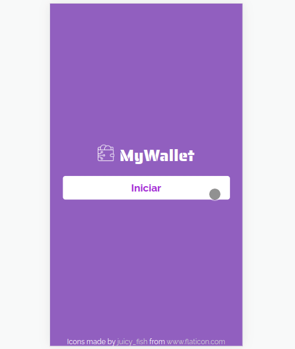

# My Wallet: Aplicação de Gerenciamento de Finanças


<h2>Sobre:</h2>

<div text-align="center" align="left">
<p>Trata-se de um aplicativo web cujo objetivo é acompanhar os seus rendimentos e gastos através de entradas e saídas criadas no aplicativo, o qual calculará, ao fim, o seu montante final. </p>
</div>

<div align="left">
<h2>Principais Funcionalidades:</h2>

<ul align="left">
 <li align="left">👤 Criação de Usuário + Login/Logout</li>
 <li align="left">📅 Criação de <strong>Entradas</strong> e <strong>Saídas</strong></li>
 <li align="left">❌ Deleção de <strong>Entradas</strong> e <strong>Saídas</strong></li>
 <li align="left">📜 Listagem de todos os eventos financeiros do usuário</li>
 <li align="left">➗ Cálculo final das entradas menos as saídas</li>
</ul>

</div>

<div align="left">
<h2>Link para Demo:</h2>
Clique aqui para acessar => <a href="https://projeto14-mywallet-front-eight-olive.vercel.app">My Wallet</a>
</div>

<div align="left">
<h2>Como foi feito:</h2>
<p>Foi desenvolvido em ReactJS, utilizando, principalmente, das bibliotecas React Router Dom e Styled Components, e consumindo e gravando dados vindos da API <a href="https://github.com/isabellexvr/projeto14-mywallet-back" >My Wallet Back End</a>, que trás informações de um banco de dados NoSQL, MongoDB. </p>
<h4>Stack de Tecnologias Utilizadas para o Front End:</h4>


<h4>Por que foi feito?</h4>
<p>Foi o meu primeiro projeto Full Stack, em que exercitei os meus aprendizados em MongoDB, Express.js e ReactJS. </p>
</div>

## Como executar para desenvolvimento no Seu Computador

1. Baixe e execute o <a href="https://github.com/isabellexvr/projeto14-mywallet-back" >My Wallet Back End</a> conforme as instruções do README do repositório

2. Instale as dependências do Front End:
```bash
npm i
```
3. Execute-o:
```bash
npm start
```
4. Ou, opcionalmente, você pode buildá-lo:
```bash
npm run build
```
5. E, então, acessar http://localhost:3000
